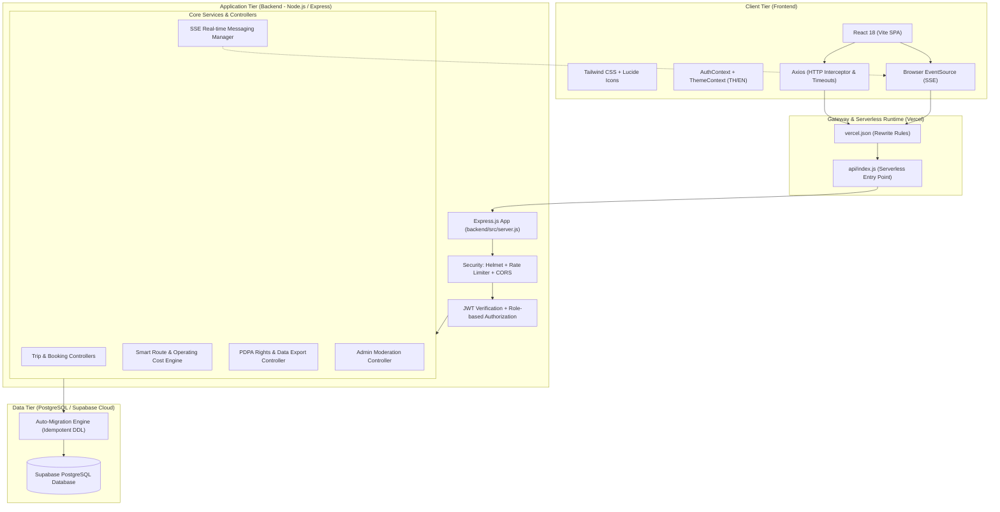
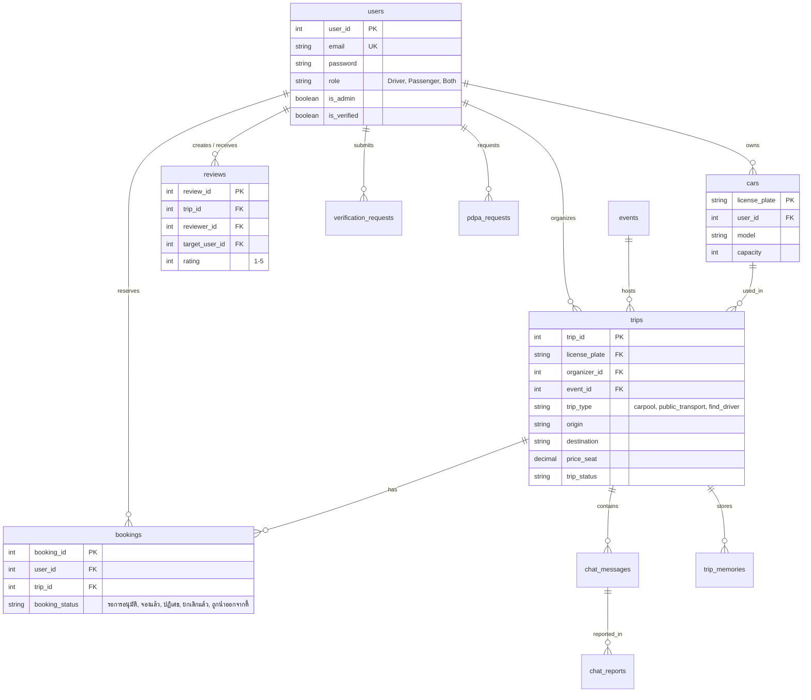
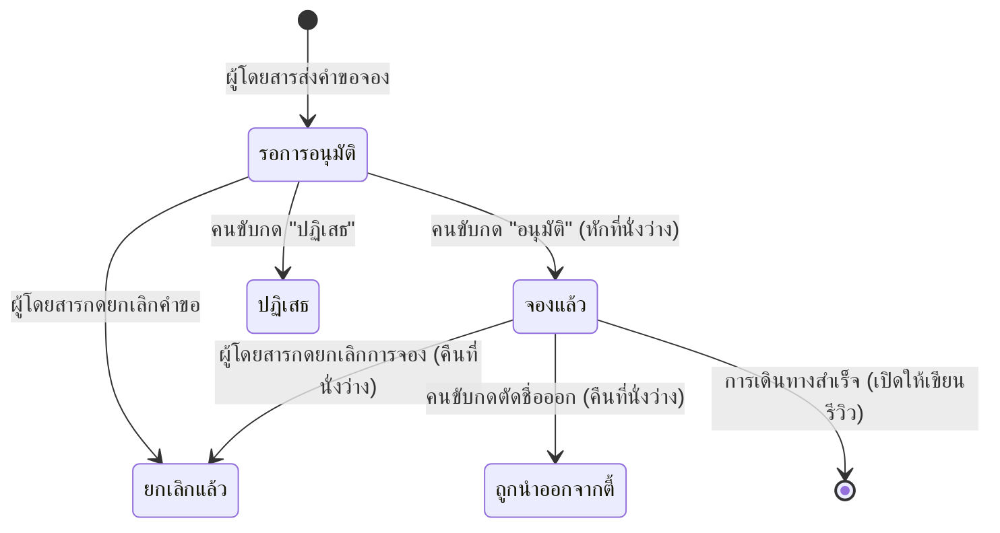

# คู่มือเตรียมสอบสัมภาษณ์โครงงาน: Iko-Share (Project Defense Guide)

> **เอกสารสรุปข้อมูลโครงงานเชิงลึก สำหรับใช้ตอบคำถามและนำเสนอต่อคณะกรรมการ/อาจารย์ที่ปรึกษา**  
> **ชื่อโครงงาน:** Iko-Share — แพลตฟอร์มแชร์การเดินทางร่วมกันสู่อีเวนต์และสถานที่ท่องเที่ยว  
> **เวอร์ชันระบบ:** 1.0.0 (Release Candidate) | **วันที่ปรับปรุง:** ตุลาคม 2569  

---

## สารบัญ (Table of Contents)
1. [บทนำและที่มาของโครงงาน (Executive Summary & Problem Statement)](#1-บทนำและที่มาของโครงงาน)
2. [สถาปัตยกรรมระบบและเหตุผลในการเลือกเทคโนโลยี (System Architecture & Tech Stack)](#2-สถาปัตยกรรมระบบและเหตุผลในการเลือกเทคโนโลยี)
3. [โครงสร้างฐานข้อมูลและโมเดลข้อมูล (Database Schema & ER Design)](#3-โครงสร้างฐานข้อมูลและโมเดลข้อมูล)
4. [ฟังก์ชันแกนหลักและขั้นตอนการทำงาน (Core Modules & System Workflows)](#4-ฟังก์ชันแกนหลักและขั้นตอนการทำงาน)
5. [จุดเด่นทางเทคนิคและอัลกอริทึม (Highlight Algorithms & Academic Merits)](#5-จุดเด่นทางเทคนิคและอัลกอริทึม)
6. [ผลการทดสอบระบบและคุณภาพซอฟต์แวร์ (Testing & QA Results)](#6-ผลการทดสอบระบบและคุณภาพซอฟต์แวร์)
7. [คลังคำถาม-คำตอบที่อาจารย์ชอบถาม (Frequently Asked Defense Q&A)](#7-คลังคำถาม-คำตอบที่อาจารย์ชอบถาม)
8. [ข้อจำกัดและทิศทางการพัฒนาต่อยอด (Limitations & Future Work)](#8-ข้อจำกัดและทิศทางการพัฒนาต่อยอด)
9. [ลำดับขั้นตอนการสาธิตระบบ (Demo Sequence Checklist)](#9-ลำดับขั้นตอนการสาธิตระบบ)

---

## 1. บทนำและที่มาของโครงงาน

### 1.1 ที่มาและความสำคัญ (Problem Statement)
* **ปัญหาค่าใช้จ่ายในการเดินทาง:** ค่าน้ำมันและค่าผ่านทางมีราคาสูง การเดินทางคนเดียวด้วยรถยนต์ส่วนบุคคลทำให้เกิดภาระค่าใช้จ่ายที่ไม่จำเป็น
* **ปัญหาการจราจรและที่จอดรถในงานอีเวนต์:** งานเทศกาล คอนเสิร์ตขนาดใหญ่ (เช่น อิมแพ็ค, สวนลุมพินี, เขาใหญ่) ประสบปัญหาการจราจรติดขัดรุนแรงและที่จอดรถไม่เพียงพอ เพราะต่างคนต่างขับรถไปเอง
* **ปัญหารถรับจ้างโก่งราคา:** ช่วงเลิกงานอีเวนต์ขนาดใหญ่ มักเกิดภาวะเรียกรถรับจ้างยากและมีราคาแพงกว่าปกติ
* **การขาดแพลตฟอร์ม Carpooling ที่ปลอดภัยและถูกกฎหมายในไทย:** แพลตฟอร์มส่วนใหญ่เน้น Ride-hailing เพื่อการค้า (Commercial) ซึ่งมีข้อจำกัดด้านกฎหมายรถสาธารณะ แต่ไทยยังขาดระบบแบ่งปันการเดินทาง (True Carpooling) ที่เน้นหารต้นทุนตามจริงและมีความปลอดภัยระดับยืนยันตัวตน

### 1.2 วัตถุประสงค์ของโครงงาน (Project Objectives)
1. พัฒนาระบบแชร์การเดินทางร่วมกัน (Carpooling Web Application) ที่เน้นเชื่อมโยงผู้ใช้ที่มีปลายทางเดียวกัน เช่น งานเทศกาล หรือสถานที่ท่องเที่ยว
2. ออกแบบระบบคำนวณและแนะนำอัตราค่าโดยสารที่เป็นธรรม (Fair Pricing Model) โดยอิงจากระยะทาง ค่าน้ำมันจริง และค่าสึกหรอของยานพาหนะ
3. สร้างความปลอดภัยและความน่าเชื่อถือให้กับสังคมผู้ร่วมเดินทาง ด้วยระบบตรวจสอบตัวตน (Identity Verification / KYC) และระบบประเมินผู้ใช้ร่วมกัน (Mutual Peer Review)
4. ออกแบบระบบให้สอดคล้องกับพระราชบัญญัติคุ้มครองข้อมูลส่วนบุคคล พ.ศ. 2562 (PDPA Compliance) อย่างสมบูรณ์

---

## 2. สถาปัตยกรรมระบบและเหตุผลในการเลือกเทคโนโลยี

### 2.1 แผนภาพสถาปัตยกรรม (System Architecture Diagram)

### 2.2 ตารางเหตุผลในการเลือกใช้เทคโนโลยี (Tech Stack Justification)
*(จุดที่คณะกรรมการมักจะถาม: ทำไมถึงเลือกเทคโนโลยีนี้?)*

| หมวดหมู่ | เทคโนโลยีที่เลือก | เหตุผลทางวิชาการและข้อดี | ทำไมไม่เลือกทางเลือกอื่น? |
| :--- | :--- | :--- | :--- |
| **Frontend Framework** | **React 18 + Vite** | คอมโพเนนต์เป็นอิสระ (Component-based), มี Virtual DOM และรองรับ Code Splitting (`lazy`/`Suspense`) ทำให้โหลดหน้าเว็บได้รวดเร็ว | ดีกว่า Create React App (CRA) ที่ช้าและ deprecated ไปแล้ว และเบากว่า Next.js เมื่อต้องการทำ Client-side SPA คล่องตัว |
| **CSS Framework** | **Tailwind CSS** | Utility-first styling ทำให้ขนาด bundle เล็ก (Purge unused CSS), ปรับเปลี่ยน Theme และ Responsive Design ได้รวดเร็ว | ไม่เลือก Bootstrap หรือ UI Library สำเร็จรูปหนาเทอะทะ เพราะปรับแต่ง Interaction และ Modern Glassmorphism ได้ยากกว่า |
| **Backend Runtime** | **Node.js + Express** | สถาปัตยกรรม Non-blocking I/O Event-driven เหมาะอย่างยิ่งกับ Web API ที่มีงาน I/O หนัก เช่น SSE Stream และฐานข้อมูล | ทรัพยากรเบากว่า Java/Spring Boot และเขียนโค้ดได้รวดเร็วกว่าในสเกลโปรเจกต์ระดับนี้ |
| **Database** | **PostgreSQL (Supabase)** | มีความเสถียร รองรับความสัมพันธ์ตารางซับซ้อน (Relational Data Integrity), รองรับ ACID Transaction, มี Constraint ตรวจสอบความถูกต้อง พร้อม Connection Pooler (Supavisor) ในตัว | ดีกว่า NoSQL (MongoDB) เพราะข้อมูลเที่ยวรถ การจอง และสิทธิ์ มีโครงสร้างสัมพันธ์กันอย่างเคร่งครัด (Foreign Key Integrity) |
| **Real-time Protocol** | **Server-Sent Events (SSE)** | ใช้ HTTP มาตรฐาน, รองรับ HTTP/2 Multiplexing, ฝั่ง Browser มี Auto-reconnect ในตัว, ประหยัด overhead กว่า WebSocket | WebSocket ต้องใช้ Connection แบบ Full-Duplex และมีปัญหาเรื่อง State บน Serverless Lambda ขณะที่แชทในทริปต้องการเพียง Server-to-Client Push ข้อความใหม่ |
| **Cloud Hosting & DB** | **Vercel + Supabase** | Serverless Architecture จ่ายตามการใช้งานจริง (Zero-idle cost), มี Global CDN ในตัว, มี Dashboard & Table Editor จัดการข้อมูลง่าย และ Deploy อัตโนมัติจาก GitHub | ประหยัดค่าใช้จ่ายและเวลาดูแลเซิร์ฟเวอร์ (Zero-ops) เมื่อเทียบกับการเช่า VM แบบดั้งเดิม |

---

## 3. โครงสร้างฐานข้อมูลและโมเดลข้อมูล

ฐานข้อมูลได้รับการออกแบบให้มีความสัมพันธ์กันอย่างถูกต้องตามหลัก **3rd Normal Form (3NF)** ประกอบด้วย 13 ตารางหลัก:

### จุดเด่นของการออกแบบฐานข้อมูล (Database Highlights)
1. **ป้องกันข้อมูลซ้ำซ้อนด้วย Unique Composite Indexes:**
   * `reviews (trip_id, reviewer_id, target_user_id)`: ป้องกันผู้ใช้รีวิวคนเดียวกันซ้ำในทริปเดียว หากกดซ้ำจะเป็นการ Update รีวิวเดิม
   * `chat_reports (message_id, reporter_id)`: ป้องกันผู้ใช้คนเดียวกดสแปมรายงานข้อความเดียวกัน
2. **ระบบ Self-healing Idempotent Migration (`backend/src/config/migrate.js`):**
   * แก้ปัญหาเรื่อง Database Schema ไม่ตรงกันบน Serverless Cold Start โดยระบบจะตรวจสอบคำสั่ง `CREATE TABLE IF NOT EXISTS` และ `ADD COLUMN IF NOT EXISTS` โดยอัตโนมัติก่อนรับ Request

---

## 4. ฟังก์ชันแกนหลักและขั้นตอนการทำงาน

### 4.1 ระบบจัดการบทบาท (Role-based System)
* **Passenger (ผู้โดยสาร):** ค้นหาทริป, ยื่นขอจองที่นั่ง, เปิดทริปประเภท "หาคนขับพาไป", ร่วมแชท, รีวิวเพื่อนร่วมทาง
* **Driver (คนขับรถ):** ลงทะเบียนข้อมูลยานพาหนะ, สร้างทริปคาร์พูล, อนุมัติ/ปฏิเสธผู้โดยสาร, นำผู้โดยสารที่ไม่เหมาะสมออกจากตี้
* **Both (เป็นได้ทั้งสองบทบาท):** ใช้งานได้ครบทั้งฝั่งผู้ขับและผู้โดยสาร
* **Admin (ผู้ดูแลระบบ):** ตรวจสอบและอนุมัติเอกสาร KYC (บัตรประชาชน/ใบขับขี่), ตรวจสอบข้อความแชทที่มีการรายงาน (Reports), จัดการคำร้องเรียน (Support), ตรวจสอบและดำเนินการตามคำร้องขอ PDPA

### 4.2 วงจรสถานะของการจอง (Booking Lifecycle State Machine)

### 4.3 ระบบห้องแชทเรียลไทม์ประจำทริป (In-Trip Chat Security)
* **Access Control Guard:** ผู้ที่เปิดอ่านหรือพิมพ์ในห้องแชทได้ จะต้องเป็น:
  1. หัวหน้าทริป (Organizer / Car Owner)
  2. ผู้โดยสารที่สถานะการจองเป็น **"จองแล้ว" (Approved)** เท่านั้น (ผู้ที่รอการอนุมัติหรือถูกปฏิเสธจะไม่สามารถเข้าถึงข้อความแชทได้)
* **Server-Sent Events (SSE) Stream:** ส่งข้อความทันทีด้วย Latency ต่ำ
* **Adaptive Fallback Polling (15 วินาที):** มีตัวสำรองทำงานคู่กัน หากอินเทอร์เน็ตของผู้ใช้หลุดหรือ SSE ขัดข้อง ระบบจะสลับไปดึงข้อมูลอัตโนมัติทุก 15 วินาทีเพื่อความเสถียร

---

## 5. จุดเด่นทางเทคนิคและอัลกอริทึม

### 5.1 ระบบประเมินเส้นทางและการคิดราคาเป็นธรรม (Smart Route & Fair Share Model)
ระบบในไฟล์ [`routeService.js`](file:///home/lunasias/Documents/GitHub/iko-share/backend/src/services/routeService.js) เป็นจุดเด่นสำคัญในการตอบคำถามเชิงวิชาการ:

#### 1) การคำนวณระยะทางแบบไฮบริด (Hybrid Distance Engine)
* **ลำดับที่ 1:** เรียกใช้ **Google Routes API / Distance Matrix API** เมื่อมีการตั้งค่า API Key
* **ลำดับที่ 2 (Smart Fallback):** หากไม่มี API Key หรือโควตาเต็ม ระบบจะใช้ **Thailand Smart Highway Router** ภายในตัว:
  * มีฐานข้อมูลพิกัด (Lat/Long) ของจังหวัดและชุมทางหลักในไทย (กทม, หมอชิต, รังสิต, พัทยา, โคราช, เชียงใหม่, สจล. ลาดกระบัง ฯลฯ)
  * คำนวณระยะทางทรงกลมด้วย **Haversine Formula**:
    $$d = 2R \arcsin\left(\sqrt{\sin^2\left(\frac{\Delta\phi}{2}\right) + \cos(\phi_1)\cos(\phi_2)\sin^2\left(\frac{\Delta\lambda}{2}\right)}\right)$$
  * ปรับค่าชดเชยความคดเคี้ยวของโครงข่ายทางหลวงไทยด้วยค่าสัมประสิทธิ์ **Winding Factor ($\times 1.28$)** เพื่อให้ได้ระยะทางใกล้เคียงถนนจริง

#### 2) สูตรการคำนวณต้นทุนดำเนินงาน (Operating Cost Formula)
ระบบไม่ได้ให้คนขับตั้งราคาตามใจชอบเพื่อแสวงหากำไรเกินควร แต่คำนวณตามหลักเศรษฐศาสตร์ยานพาหนะ:
$$\text{Total Cost} = (\text{Distance} \times \text{Fuel Rate}) + (\text{Distance} \times \text{Depreciation Rate})$$
* **อัตราค่าน้ำมันเฉลี่ย (Fuel Rate):** 2.20 บาท/กม.
* **อัตราค่าสึกหรอและบำรุงรักษา (Depreciation Rate):** 1.30 บาท/กม.
* **ราคาแนะนำต่อที่นั่ง (Recommended Seat Price):**
  $$\text{Seat Price} = \frac{\text{Total Cost}}{\text{Available Seats}}$$
  *(ปัดเศษให้ลงท้ายด้วย 10 บาทเพื่อความสะดวกในการหารเงิน)*

---

## 6. ผลการทดสอบระบบและคุณภาพซอฟต์แวร์

อ้างอิงจากเอกสารรายงานสรุปการทดสอบ [`SOFTWARE_TEST_SUMMARY_REPORT.md`](file:///home/lunasias/Documents/GitHub/iko-share/docs/SOFTWARE_TEST_SUMMARY_REPORT.md):

* **เกณฑ์การประเมินและการผ่านการทดสอบ:**
  * จำนวนชุดทดสอบทั้งหมด: **150 Test Cases**
  * จำนวนเคสที่ผ่าน (Passed): **144 Cases**
  * อัตราความสำเร็จ (Overall Pass Rate): **96.0%** (สูงกว่าเกณฑ์ขั้นต่ำ 95%)
  * ข้อบกพร่องระดับวิกฤต (Critical / Blocker): **แก้ไขครบถ้วน 100% (0 คงค้าง)**
* **ขอบเขตการทดสอบที่ดำเนินการ:**
  1. **Functional Testing:** ทดสอบ Flow การลงทะเบียน, การสร้างทริป, การจอง, การแชท และการรีวิว
  2. **Integration Testing:** ทดสอบการเชื่อมต่อระหว่าง React Frontend, Express API, และ Supabase PostgreSQL
  3. **Security Testing:** ทดสอบการป้องกัน JWT Token, Password Bcyrpt Hashing, Rate Limiting และ Role Authorization
  4. **User Acceptance Testing (UAT):** ทดสอบความพึงพอใจและประสบการณ์ใช้งานจากกลุ่มตัวอย่างผู้ใช้จริง

---

## 7. คลังคำถาม-คำตอบที่อาจารย์ชอบถาม (Frequently Asked Defense Q&A)

### หมวดที่ 1: ปัญหา กฎหมาย และความคุ้มค่า (Business & Legal Aspects)

> **Q1: ทำไมถึงต้องทำ Iko-Share ในเมื่อมี Grab, Bolt หรือรถตู้ประจำทางอยู่แล้ว?**  
> **แนวทางการตอบ:**  
> "Grab และ Bolt เป็นระบบ **Ride-hailing เพื่อการค้า (Commercial Service)** ที่มีคนขับทำเป็นอาชีพ ค่าโดยสารคิดตามราคาเชิงพาณิชย์และมักปรับราคาสูงขึ้นมาก (Surge Pricing) ในช่วงเวลาเลิกงานอีเวนต์ ส่วนรถตู้ประจำทางก็มีเส้นทางและตารางเวลาที่ไม่ยืดหยุ่น  
> แต่ **Iko-Share คือ Carpooling แท้จริง** ซึ่งเน้นการเดินทางไปในทิศทางเดียวกันของผู้มีรถและผู้โดยสาร โดยมีวัตถุประสงค์เพื่อ **'แบ่งเบาต้นทุนค่าน้ำมันจริง'** ไม่ใช่การรับจ้างเพื่อแสวงหากำไร อีกทั้งยังช่วยสร้างคอมมูนิตี้สำหรับผู้ที่ชอบไปเที่ยวงานเทศกาลหรือคอนเสิร์ตเหมือนกันครับ"

> **Q2: ระบบนี้ถือว่าเป็นรถรับจ้างสาธารณะผิดกฎหมาย (ป้ายดำรับจ้าง) หรือไม่?**  
> **แนวทางการตอบ:**  
> "ไม่ผิดกฎหมายครับ เนื่องจากระบบได้รับการออกแบบภายใต้หลักการ **'Carpooling / Ride-sharing'**:
> 1. คนขับเดินทางไปยังจุดหมายนั้นอยู่แล้ว ไม่ได้ขับวนเพื่อรับจ้างทั่วไป
> 2. ระบบมี **Smart Operating Cost Calculator** ที่คำนวณเฉพาะค่าน้ำมันและค่าสึกหรอตามระยะทางจริง โดยกำหนดเพดานราคาต่อที่นั่งให้เป็นเพียงการ **'แชร์ต้นทุน' (Cost-sharing)** มิใช่ค่าจ้างเชิงพาณิชย์
> 3. ในระบบมีข้อตกลงและเงื่อนไข (Terms of Service) ระบุชัดเจนว่าผู้ขับขี่และผู้โดยสารตกลงร่วมเดินทางเพื่อแบ่งปันค่าใช้จ่ายครับ"

> **Q3: หากเกิดกรณีอาชญากรรม ล่วงละเมิด หรืออุบัติเหตุระหว่างเดินทาง ทางระบบมีมาตรการป้องกันและรับผิดชอบอย่างไร?**  
> **แนวทางการตอบ:**  
> "ระบบวางมาตรการป้องกันความปลอดภัยเป็น 4 ระดับ (Multi-layer Safety):
> 1. **KYC Verification:** ผู้ใช้สามารถยื่นบัตรประชาชนและใบขับขี่ให้แอดมินตรวจสอบเพื่อรับตรา Verified Badge สีฟ้า ช่วยคัดกรองตัวตน
> 2. **Mutual Peer Review:** ระบบรีวิวและให้คะแนนดาวหลังจากเดินทางร่วมกัน ทำให้ทุกคนสามารถตรวจสอบประวัติและความคิดเห็นของผู้ร่วมทางก่อนตัดสินใจกดอนุมัติหรือร่วมทริป
> 3. **Digital Footprint & Traceability:** ทุกเที่ยวเดินทางมีบันทึกเวลา พิกัดต้นทาง-ปลายทาง และประวัติการแชทในฐานข้อมูล ซึ่งสามารถใช้เป็นหลักฐานส่งเจ้าหน้าที่ตำรวจได้ทันทีหากเกิดเหตุ
> 4. **Legal Disclaimer:** มีการระบุเงื่อนไขข้อตกลงชัดเจนว่าแพลตฟอร์มเป็นตัวกลางในการเชื่อมต่อ และผู้ขับขี่ต้องมี พ.ร.บ. คุ้มครองผู้ประสบภัยจากรถตามกฎหมายครับ"

---

### หมวดที่ 2: สถาปัตยกรรมและการพัฒนาซอฟต์แวร์ (Technical & Architecture)

> **Q4: ทำไมระบบแชทถึงเลือกใช้ Server-Sent Events (SSE) แทนที่จะใช้ WebSocket?**  
> **แนวทางการตอบ:**  
> "เหตุผลสำคัญมี 3 ประการครับ:
> 1. **ความเหมาะสมกับสถาปัตยกรรม Serverless (Vercel):** WebSocket ต้องการ Persistent TCP Connection ที่ต้องรักษา State ตลอดเวลา ซึ่งไม่เหมาะกับ Serverless Functions ที่ทำงานแบบ Stateless และมี Timeout
> 2. **ลักษณะการใช้งานจริง:** การส่งข้อความในทริปเกิดขึ้นผ่าน HTTP POST ปกติ ส่วนที่ต้องการความเรียลไทม์คือการ **กระจายข้อความใหม่จากเซิร์ฟเวอร์ไปยังสมาชิกในทริป (One-way Push)** ซึ่ง SSE ทำงานได้ดีมาก ใช้ HTTP มาตรฐาน และทำงานร่วมกับ HTTP/2 Multiplexing ได้อย่างไร้รอยต่อ
> 3. **ความทนทานต่อเน็ตมือถือ:** SSE มีกลไก Auto-reconnect ในตัวของเบราว์เซอร์ และทีมพัฒนายังได้เสริม **Adaptive Fallback Polling (15 วินาที)** สำรองไว้ ทำให้แชทไม่หลุดแม้สัญญาณอินเทอร์เน็ตมือถือจะขาดหายชั่วคราวครับ"

> **Q5: ทำไมถึงเลือกใช้ Relational Database (PostgreSQL) แทน MongoDB ที่เป็น NoSQL ยอดนิยม?**  
> **แนวทางการตอบ:**  
> "เนื่องจากข้อมูลของระบบ Iko-Share มี **ความสัมพันธ์และความถูกต้องทางโครงสร้างสูงมาก (Relational Integrity & ACID Properties)**:
> * การจองที่นั่ง (Bookings) ต้องสัมพันธ์กับจำนวนที่นั่งคงเหลือของทริป (Trips)
> * การอนุญาตให้เข้าห้องแชทหรือให้สิทธิ์รีวิว ต้องอิงสถานะการจองที่แน่นอน
> * มีการใช้ **Foreign Key Constraints แบบ CASCADE/SET NULL** และ **Unique Composite Indexes** (เช่น ห้ามรีวิวซ้ำ ห้ามสแปมรีพอร์ตข้อความซ้ำ)
> หากใช้ MongoDB ทางเราจะต้องเขียน Logic จัดการ Referential Integrity เองที่ฝั่ง Application Code ซึ่งมีความเสี่ยงสูงที่จะเกิดข้อมูลไม่สอดคล้องกัน (Data Inconsistency) เมื่อมี Request เข้ามาพร้อมกันครับ"

> **Q6: ระบบนี้สอดคล้องกับ พ.ร.บ. คุ้มครองข้อมูลส่วนบุคคล (PDPA) อย่างไรบ้าง?**  
> **แนวทางการตอบ:**  
> "ระบบ Iko-Share ได้นำหลักการ **Privacy by Design** มาใช้จริง ครอบคลุม:
> 1. **การขอความยินยอม (Consent Management):** มี Cookie Banner ให้เลือกประเภทคุกกี้ และมี Checkbox ขอความยินยอมจัดการข้อมูลส่วนบุคคลในหน้าสมัครสมาชิก
> 2. **ระบบใช้สิทธิของเจ้าของข้อมูล (Data Subject Rights):** มีหน้า `/privacy-rights` ที่ผู้ใช้สามารถยื่นคำร้องได้ครบ 7 สิทธิตามกฎหมาย (เช่น สิทธิขอเข้าถึงและรับสำเนา ม.30, สิทธิขอลบข้อมูล ม.33, สิทธิขอโอนย้ายข้อมูล ม.31)
> 3. **Data Portability:** ผู้ใช้สามารถกดส่งออกข้อมูลประวัติและข้อมูลส่วนบุคคลของตนเองออกมาเป็นไฟล์ดิจิทัลได้ทันที
> 4. **Admin PDPA Workflow:** ฝั่งแอดมินมี Dashboard สำหรับตรวจสอบและอัปเดตสถานะการปฏิบัติตามคำร้องขอ PDPA พร้อมบันทึกประวัติ (Audit Log) ครับ"

---

## 8. ข้อจำกัดและทิศทางการพัฒนาต่อยอด (Limitations & Future Work)

*(เตรียมไว้ตอบเมื่ออาจารย์ถามว่า: 'ถ้ามีเวลาทำต่ออีก 6 เดือน จะทำอะไรเพิ่ม?')*

1. **ระบบชำระเงินอัตโนมัติ (Payment Gateway & Escrow System):**
   * ปัจจุบัน: ใช้การตกลงจ่ายเงินหรือโอนเงินตรงระหว่างผู้ใช้ (มีหน้าแนบสลิป/หลักฐาน)
   * แผนต่อยอด: นำระบบ **Escrow Payment** (เช่น Omise / Stripe) มาพักเงินค่าโดยสารไว้ในระบบกลาง และจะโอนให้คนขับเมื่อการเดินทางสิ้นสุดอย่างปลอดภัย
2. **ระบบแผนที่แบบ Real-time GPS Tracking:**
   * เชื่อมต่อ WebSocket หรือ WebRTC เพื่อแสดงตำแหน่งรถของคนขับแบบสดบนแผนที่ Leaflet / Mapbox ในวันเดินทาง เพื่อให้ผู้โดยสารรู้เวลาถึงจุดนัดพบที่แน่นอน
3. **การจัดการ Connection Pool และ Real-time ข้ามเซิร์ฟเวอร์ในสเกลใหญ่:**
   * ใช้งาน **Redis Pub/Sub** เพื่อกระจายข้อความแชทข้าม Serverless / Container Instances เมื่อมีผู้ใช้งานหลักแสนคน
   * เปิดใช้งาน **Supabase Connection Pooling (Supavisor / Transaction Mode บนพอร์ต 6543)** อย่างเต็มรูปแบบ และขยายไปใช้งาน **Supabase Storage** สำหรับจัดเก็บไฟล์เอกสาร KYC และรูปภาพในทริปแทนการเก็บในตารางฐานข้อมูล

---

## 9. ลำดับขั้นตอนการสาธิตระบบ (Demo Sequence Checklist)

เวลาสาธิตให้อาจารย์ดู ให้เปิด 2 เบราว์เซอร์คู่กัน (เช่น Chrome ปกติ เป็น **คนขับ** และ Incognito เป็น **ผู้โดยสาร**):

1. **โชว์หน้าแรก (Home Page):** แสดง Banner, ค้นหาทริปตามงานอีเวนต์ (เช่น คอนเสิร์ตในสวน) และสลับภาษา ไทย / อังกฤษ
2. **โชว์การสร้างทริป (Create Trip - ฝั่งคนขับ):**
   * เลือกรถยนต์, เลือกจุดเริ่มต้น - ปลายทาง
   * แสดงระบบ **คำนวณระยะทางและค่าน้ำมัน/ค่าสึกหรออัตโนมัติ** ให้เห็นราคาแนะนำต่อที่นั่ง
3. **โชว์การจอง (Booking - ฝั่งผู้โดยสาร):**
   * ผู้โดยสารค้นหาทริปแล้วกดขอร่วมทาง ระบุจุดนัดรับ
4. **โชว์การอนุมัติ (Driver Action):**
   * คนขับเปิดหน้าทริปของฉัน เห็นคำขอจอง แล้วกดยืนยัน (Approved) ที่นั่งว่างลดลงทันที
5. **โชว์ห้องแชทเรียลไทม์ (In-Trip Real-time Chat):**
   * พิมพ์ข้อความจากคนขับ ข้อความเด้งขึ้นที่หน้าจอผู้โดยสารทันทีผ่าน **SSE**
   * ลองกดปุ่มรายงานข้อความไม่เหมาะสม (Flag Report)
6. **โชว์หน้าจอผู้ดูแลระบบ (Admin Dashboard):**
   * เข้าด้วย `admin@ikoshare.com`
   * โชว์สถิติ, รายการขออนุมัติ KYC, รายการข้อความที่ถูกรีพอร์ตพร้อมปุ่มลบข้อความ
7. **โชว์หน้า PDPA Rights:**
   * แสดงการขอใช้สิทธิข้อมูลส่วนบุคคลและการดาวน์โหลดข้อมูลส่วนตัว (Data Export)
